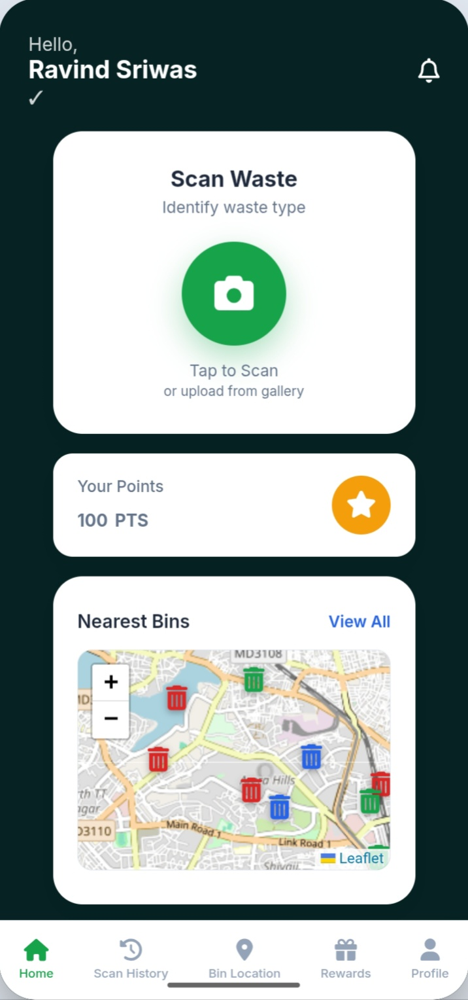
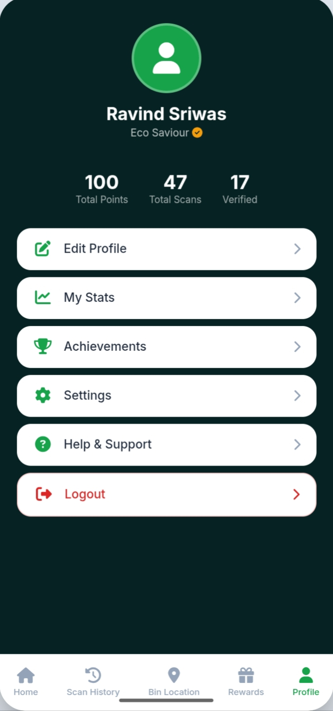
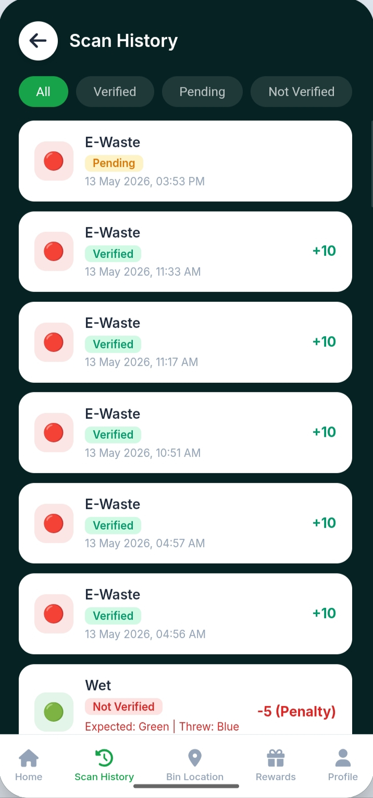
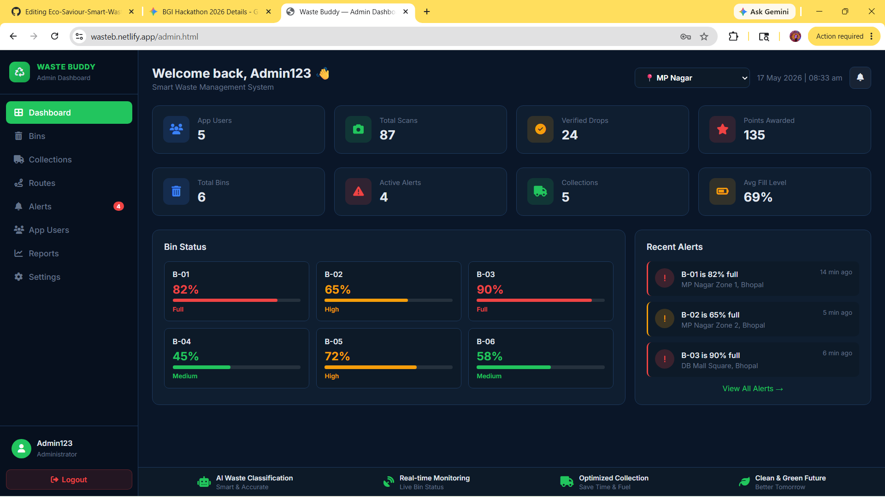

🔴 Live Demo: [Click Here to View](https://wasteb.netlify.app/index.html)

# ♻️ Eco Saviour: AI-Powered Smart Waste Management System

A complete full-stack IoT and AI-integrated solution built during the **BGI Hackathon 2026**. Eco Saviour aims to transform traditional "blind" waste management into a smart, rewarding, and optimized ecosystem.

## 🚀 The Problem We Solved
Currently, waste management suffers from high logistics costs (visiting empty bins), zero real-time tracking, and manual hazardous sorting. Citizens lack awareness of proper disposal and have no motivation to segregate waste.

## 💡 Our Solution
Eco Saviour is a 6-step automated system:
1. **Scan & Identify:** User scans waste via our mobile web-app. AI guides them to the correct bin (Dry/Wet/E-waste).
2. **Auto-Classify:** In-bin AI cameras cross-verify if the user threw the correct item.
3. **Live Data Sync:** Simulated ultrasonic sensors track bin fill-levels in real-time.
4. **Smart Alerts:** Automated push notifications for bins hitting 80% capacity.
5. **Route Optimization:** Admin dashboard provides the shortest fuel-efficient route for drivers.
6. **Credit Rewards:** Instant reward points (+10) for correct disposal, and penalties (-5) for wrong bins.

## 🛠️ Tech Stack
* **Frontend:** HTML5, CSS3, Vanilla JavaScript,(ReactJS for admin)
* **Backend:** Python, Flask (RESTful API)
* **AI Engine:** OpenCV, Keras/TensorFlow (Image Classification)
* **Database:** Local JSON structures (MVP) / MongoDB ready
* **Hardware Simulation:** ESP32 & Ultrasonic logic handled via software state-management.

## 📸 Project Screenshots
Here is how the Eco Saviour app looks in action:

#### User Mobile App

  
  

#### Scan Results & History

  

#### 🖥️ Admin Dashboard (React.js)

  

## 👨‍💻 Team Members
* Ravindra Rajak
* Shivam Patel
* Shivanshi Patel
* Shiva Pandey
* Vaishnavi Thakre
